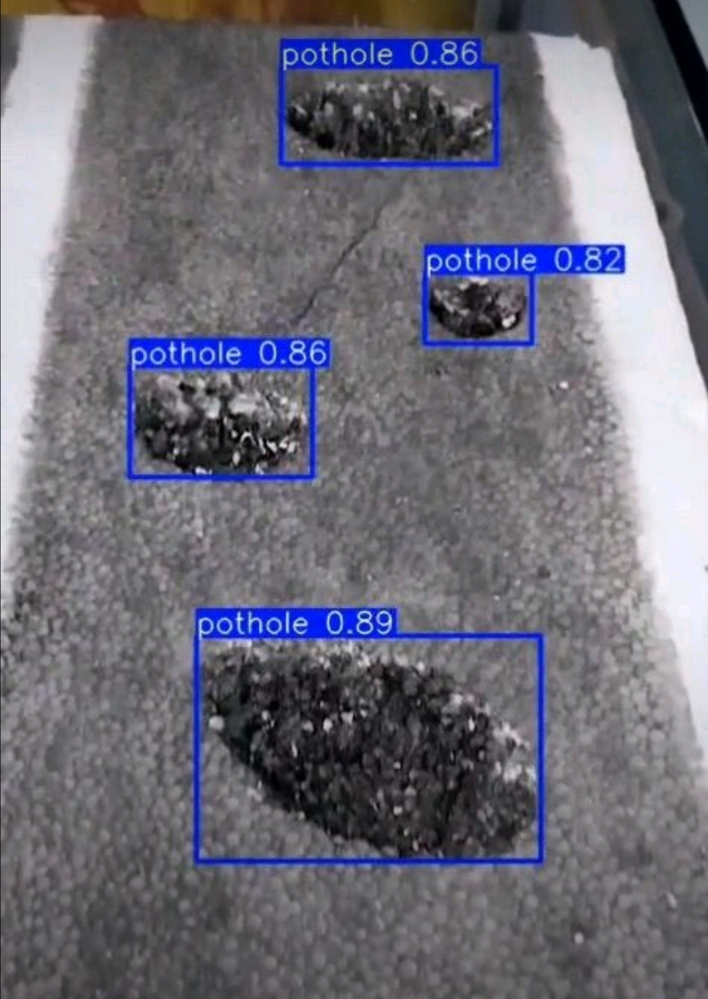
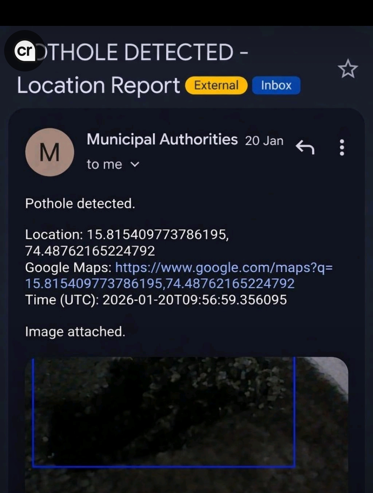
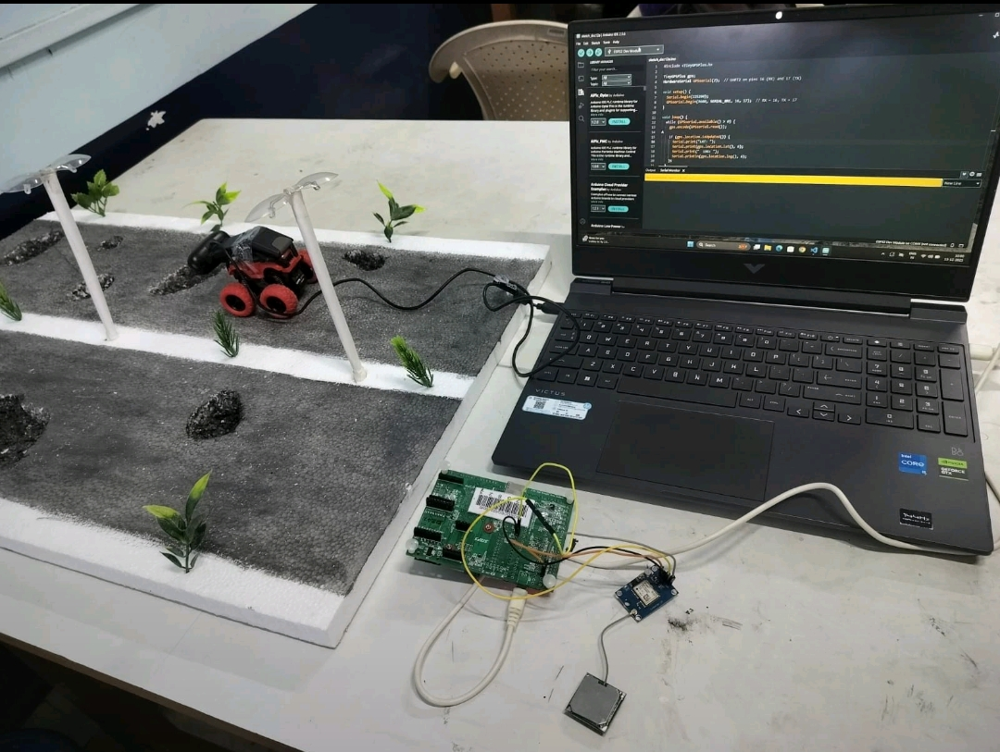

# 🚧 Road Pothole Detection and Alert System

## 📌 Overview

The **Road Pothole Detection and Alert System** is an intelligent road-safety project designed to automatically detect potholes using **YOLOv8** and report their geographical location using an **ESP32 and GPS module**.

The system combines computer vision, embedded systems, and GPS technology to identify potholes and generate a location-based alert. The detected pothole location can be shared with concerned authorities for further action.

## 🎯 Objectives

- Detect potholes automatically using computer vision.
- Use YOLOv8 for real-time pothole detection.
- Obtain the geographical location of the detected pothole using GPS.
- Interface the GPS module with ESP32.
- Generate an alert containing the pothole location.
- Provide a Google Maps link for easy location identification.

## 🚀 Features

- 🕳️ Automatic pothole detection
- 🤖 YOLOv8-based object detection
- 📍 GPS-based location tracking
- 📡 ESP32-based embedded system
- 📧 Location-based alert notification
- 🗺️ Google Maps location link
- 📷 Image-based pothole detection
- 🔔 Real-time detection and reporting

## 🛠️ Technologies Used

### Software

- Python
- YOLOv8
- OpenCV
- Ultralytics
- Computer Vision

### Hardware

- ESP32
- GPS Module (NEO-6M)
- Camera
- Embedded system components

## ⚙️ Working Principle

The system works in the following steps:

1. A camera captures images or video of the road.
2. The Python-based YOLOv8 model processes the input.
3. The trained detection model identifies potholes in the image or video.
4. When a pothole is detected, the system triggers the location-reporting process.
5. The ESP32 communicates with the GPS module to obtain the geographical coordinates.
6. The latitude and longitude of the detected pothole are obtained.
7. A location-based alert is generated containing the pothole information.
8. A Google Maps link is included so that the reported location can be easily viewed on a map.

## 🧠 Pothole Detection

YOLOv8 is used to detect potholes from road images.

The model identifies potholes using bounding boxes and provides a confidence score for each detection.

Example detection:



## 📍 Location-Based Alert

After detecting a pothole, the system generates a location report containing:

- Pothole detection status
- Latitude
- Longitude
- Google Maps location
- Detection time
- Detected image

Example:



## 🔧 Hardware Prototype

The physical prototype demonstrates the integration of the road model, ESP32, GPS module, and computer system.



## 📂 Project Structure

```text
Road-Pothole-Detection-and-Alert-System/
│
├── README.md
│
├── src/
│   └── main.ino
│
├── detection/
│   └── pothole_detection.py
│
└── images/
    ├── pothole_detection.jpeg
    ├── location_alert.jpeg
    └── hardware_prototype.jpeg
